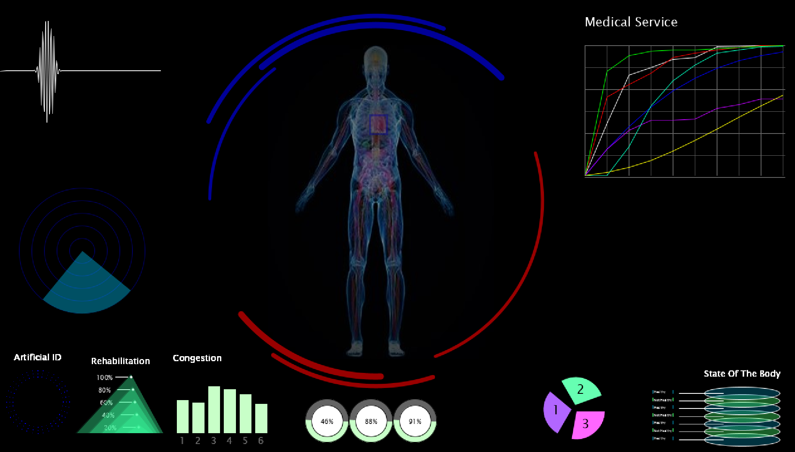

# SciFi UI Project

Name: Mariana Pirtac

Student Number: C17378303

# Description of the assignment

My project is going to represent a ui medical interface. The project is going to give an analysis of the human body. There are different graphs displaying different information about the state of the human body. Also, there is a hover function which when you use it you can see the state of the organs. If an organ is healthy it will display blue if it is not healthy it will be displayed red.
There is a function that lets you hear the heartbeat of the human body. Furthermore, you will be able to see the location of the human body.

# Instructions

- To hear the heart beat sound press on the heart. There is a blue outline around the heart you can press anywhere inside it.
- Press 'i' to connect the heart beat to the sine wave at the top, right hand side of the screen.
- To make the sine wave which is placed in the middle of the screen visible just keep the mouse pressed. The sine wave will be displayed only if the heart beat is playing.
- Press on 'p' to make the heart beat stop. 
- Press on 'm' to make the text appear.
- Hover over the location of the 'heart', 'liver', 'stomach', 'right kidney', 'left kidney' to make them display.

# How it works

For this project I used 16 class to create the final UI medical interface.

There is one supers class class called UIEllements and then there are multiple classes (ArtificialID.java, Barchart.java, BodyBackground.java, Button.java, Circle.java, Graph.java, Location.java, Ovals.java, Radar.java,Trinagles.java) which inherit from the super class.

Each of those classes are drawing various shapes. The Circle.java class draws 3 circles and 2 moving arcs around each circle. I used to pushMatrix and popMatrix to make the arcs rotate. I also used the pushMatrix and popMatrix in the ArtificialID class. The pushMAtrix and popMatrix is used to draw circles made up of dots which represent the artificial ID of a person. 

To draw the graph. I drew the gridlines first and then the lines. I used the map function to map the height of the lines. Underneath the graph there will be random text which will represent the information displayed by each line. The text is stored in a csv file. The code for loading the data and displaying the text is stored in the Ui class. The text will not be visible at all the times. In order for the text to appear the user should press on 'm'. I did this using an if statement. To use the text in ui I had to use the getters and setters. In the same csv file, I stored the information for the pie chart. That text gets displayed in the same way. The pie chart was drawn in a separate class mainly using arcs. 

To display the human body, I displayed a picture of a human body at the needed position. Then I created a hover option so that when the user will hover over the organs of the body. Each part will get displayed. Once again, I used a csv file to store each organ and their location of x and y. I used a lot of if else/else if statements to get the right position. Whenever a user will hover over the organs an image of the organ will get displayed with a label on it also if the image is red that means that the organ is not healthy if it is blue that means that it is healthy. Furthermore, there is a button with a blue outline on the heart. When you press that button, you will be able to hear the heartbeat. For the heart beat I uploaded an mp3 file with the heartbeat. I also created a separate class for the button. There is a sine wave connected to the heart beat sound so if you keep the mouse pressed while the heart beat is heard you will be able to see how the sine wave represents it. For that I had to use the frame, resolution and sample of the music. Furthermore, there is a sine wave that is displaying random data but if you press 'i' the heart beat sound will be synchronised with the sine wave. To stop the heart beat the user needs to press 'p'. For the background of the body I used several arc. I had a separate class for that called BodyBackgound.java.

There is also a radar which is supposed to represent the location of the person. Every time, the mouse will be inside the radar a dot will be displayed representing the location of mouseX mouseY. I used Pvector for the arc inside the radar. Also I used the cos and sin for the angles;

The rest of the shapes were made using various Processing libraries.

I added various elements to the arraylist called UIElements this is called polymorphism.

# What I am most proud of in the assignment

What I am most proud of is the fact taht I was able to successfully finish this assignment. For me personally doing a project like this was a very difficult task because I am not a very creative person so coming with ideas was very difficult. However, towards the end I began to finally enjoy doing this project. I am very proud of the code which I was able to write by the end.  

I think that personally I was able to learn a lot from doing this project, especially about the concepts of oop. Also, I learned a lot of new processing libraries. Furthermore, I learned how to implement various things differently. I think that doing a project like this has benefited me a lot. I strongly believe that experiencing a project like this will help me in the future. Also, because I had to use git over the entire project I was able to become more comfortable using git and I finally understand the advantages of git.


# Markdown Tutorial

This is *emphasis*

This is a bulleted list

- Item
- Item

This is a numbered list

1. Item
1. Item

This is a [hyperlink](http://bryanduggan.org)

# Headings
## Headings
#### Headings
##### Headings

This is code:

```Java
public void render()
{
	ui.noFill();
	ui.stroke(255);
	ui.rect(x, y, width, height);
	ui.textAlign(PApplet.CENTER, PApplet.CENTER);
	ui.text(text, x + width * 0.5f, y + height * 0.5f);
}
```

So is this without specifying the language:

```
public void render()
{
	ui.noFill();
	ui.stroke(255);
	ui.rect(x, y, width, height);
	ui.textAlign(PApplet.CENTER, PApplet.CENTER);
	ui.text(text, x + width * 0.5f, y + height * 0.5f);
}
```

Youtube

This is my youtube video:
[](https://www.youtube.com/watch?v=lPUuOwKOB_8)


